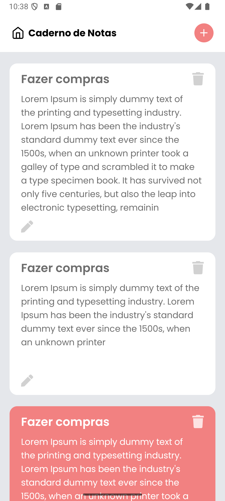
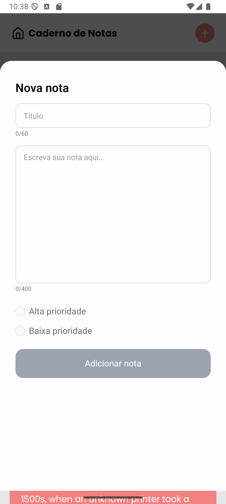
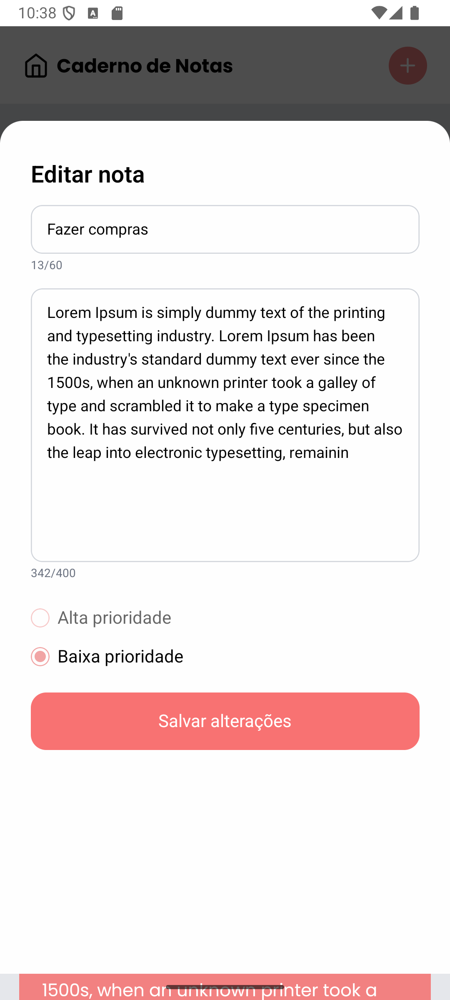
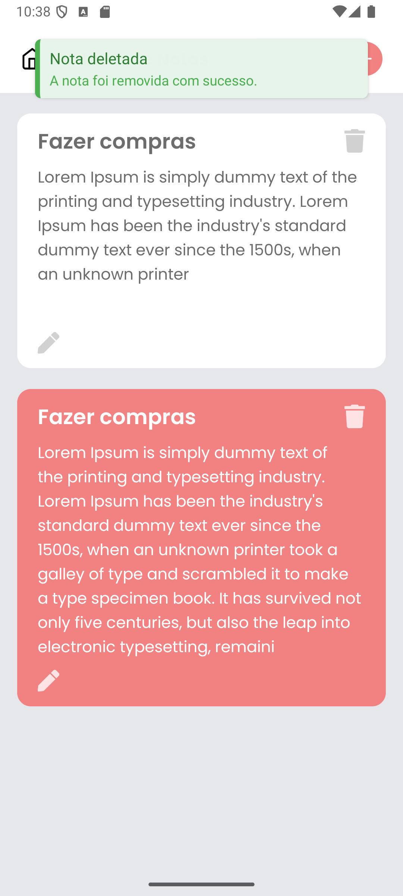

# to-do-list-mobile

Aplicativo de lista de notas/tarefas desenvolvido em React Native com Expo, focado em simplicidade, performance e experiência de usuário. Permite criar, editar, excluir e priorizar notas, com armazenamento local.

---

## ✨ Funcionalidades

- Adicionar, editar e excluir notas
- Priorização de notas (alta/baixa)
- Feedback visual com Toasts customizados
- Interface responsiva e moderna
- Armazenamento local usando AsyncStorage
- Suporte a fontes customizadas (Poppins)
- Totalmente em português 🇧🇷

---

## 🚀 Como rodar o projeto

1. **Instale as dependências:**

   ```bash
   npm install
   ```

2. **Inicie o app:**

   ```bash
   npx expo start
   ```

3. **Abra no seu dispositivo:**
   - Use o QR code no Expo Go (Android/iOS)
   - Ou rode em emulador Android/iOS

---

## 📁 Estrutura do Projeto

- `src/app/` - Rotas e telas principais
- `src/components/` - Componentes reutilizáveis (Header, Modal, Toast)
- `src/contexts/` - Contexto global de notas
- `src/services/` - Serviços de persistência de dados
- `src/styles/` - Temas e cores
- `src/types/` - Tipos TypeScript

---

## 🛠️ Tecnologias

- React Native 0.79
- Expo 53
- TypeScript
- AsyncStorage
- NativeWind (Tailwind para RN)
- React Navigation
- Toast Message

---

## 📸 Screenshots

<div style="display: flex; gap: 10px;">
  
  
  
  
</div>

- **Sincronização:** Atualmente, as notas são salvas apenas localmente. Para portfólio, está ótimo, mas poderia evoluir para sincronizar com backend.
- **Internacionalização:** O app está em português, mas poderia ser facilmente adaptado para outros idiomas.

---

## 📄 Licença

Este projeto é livre para uso pessoal e portfólio.
